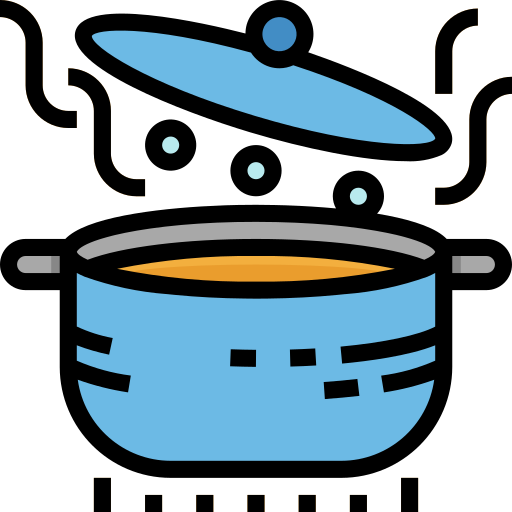

<a name="readme-top"></a>

<!-- PROJECT SHIELDS -->

[![Contributors][contributors-shield]][contributors-url]
[![Forks][forks-shield]][forks-url]
[![Stargazers][stars-shield]][stars-url]
[![Issues][issues-shield]][issues-url]
[![MIT License][license-shield]][license-url]
[![LinkedIn][linkedin-shield]][linkedin-url]

<!-- PROJECT LOGO -->
<br />
<div align="center">
  <a href="https://github.com/lgf2111/boilerplates">
    
  </a>

<h3 align="center">Boilerplates</h3>

  <p align="center">
    Boilerplates to kickstart your project 🚀
    <br />
    <a href="https://github.com/lgf2111/boilerplates"><strong>Explore the docs »</strong></a>
    <br />
    <br />
    <a href="https://github.com/lgf2111/boilerplates/issues">Report Bug</a>
    ·
    <a href="https://github.com/lgf2111/boilerplates/issues">Request Feature</a>
  </p>
</div>

<!-- TABLE OF CONTENTS -->
<details>
  <summary>Table of Contents</summary>
  <ol>
    <li>
      <a href="#usage">Usage</a>
      <ul>
        <li><a href="#method-1">Method 1 (DownGit)</a></li>
        <li><a href="#method-2">Method 2 (svn)</a></li>
      </ul>
    </li>
    <li><a href="#license">License</a></li>
    <li><a href="#contact">Contact</a></li>
  </ol>
</details>

<!-- USAGE -->

## Usage

To get a local copy of specific directory up and running follow these simple example steps.

### Method 1

1. Copy url of the directory

   ```
   https://github.com/lgf2111/boilerplates/tree/main/python/discordpy
   ```

2. Download the directory through [DownGit](downgit.github.io)

### Method 2

#### Prerequisites

- [svn](https://svnbook.red-bean.com/)

#### Installation

1. Copy url of the directory

   ```
   https://github.com/lgf2111/boilerplates/tree/main/python/discordpy
   ```

2. Replace `/tree/main` with `/trunk`

   ```
   https://github.com/lgf2111/boilerplates/trunk/python/discordpy
   ```

3. Install the directory with `svn`

   ```bash
   $ svn checkout https://github.com/lgf2111/boilerplates/trunk/python/discordpy
   ```

<p align="right">(<a href="#readme-top">back to top</a>)</p>

<!-- LICENSE -->

## License

Distributed under the MIT License. See `LICENSE.txt` for more information.

<p align="right">(<a href="#readme-top">back to top</a>)</p>

<!-- CONTACT -->

## Contact

lgf2111 - [@lgf2111](https://twitter.com/lgf2111) - lgf2111@gmail.com

Project Link: [https://github.com/lgf2111/boilerplates](https://github.com/lgf2111/boilerplates)

<p align="right">(<a href="#readme-top">back to top</a>)</p>

<!-- MARKDOWN LINKS & IMAGES -->
<!-- https://www.markdownguide.org/basic-syntax/#reference-style-links -->

[contributors-shield]: https://img.shields.io/github/contributors/lgf2111/boilerplates.svg?style=for-the-badge
[contributors-url]: https://github.com/lgf2111/boilerplates/graphs/contributors
[forks-shield]: https://img.shields.io/github/forks/lgf2111/boilerplates.svg?style=for-the-badge
[forks-url]: https://github.com/lgf2111/boilerplates/network/members
[stars-shield]: https://img.shields.io/github/stars/lgf2111/boilerplates.svg?style=for-the-badge
[stars-url]: https://github.com/lgf2111/boilerplates/stargazers
[issues-shield]: https://img.shields.io/github/issues/lgf2111/boilerplates.svg?style=for-the-badge
[issues-url]: https://github.com/lgf2111/boilerplates/issues
[license-shield]: https://img.shields.io/github/license/lgf2111/boilerplates.svg?style=for-the-badge
[license-url]: https://github.com/lgf2111/boilerplates/blob/master/LICENSE.txt
[linkedin-shield]: https://img.shields.io/badge/-LinkedIn-black.svg?style=for-the-badge&logo=linkedin&colorB=555
[linkedin-url]: https://linkedin.com/in/lee-guan-feng
